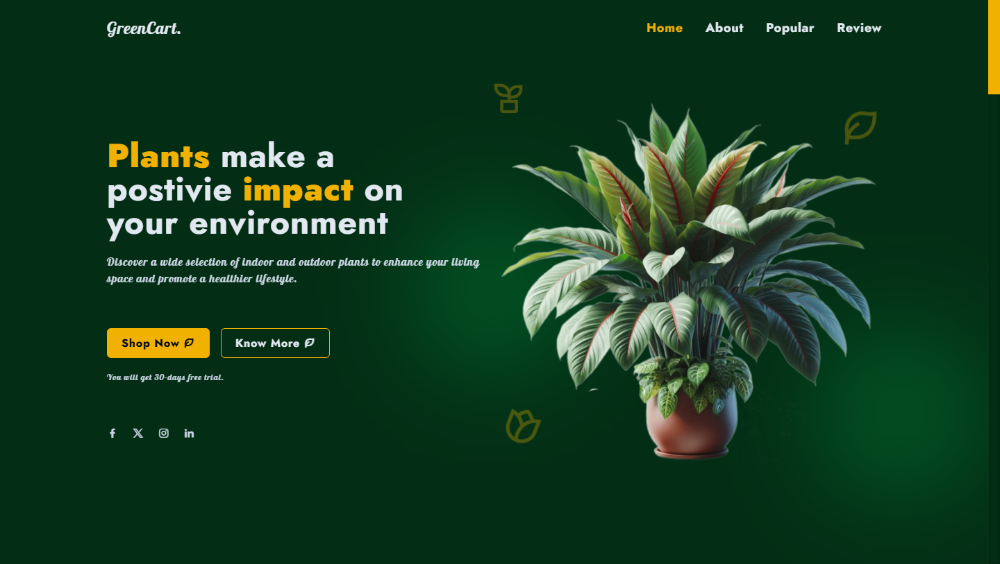
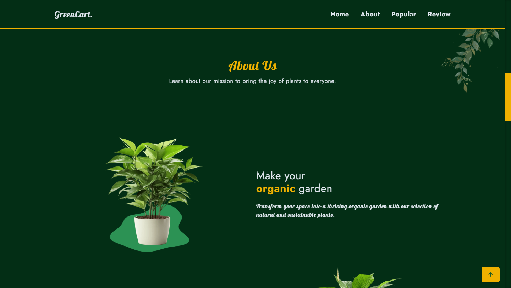
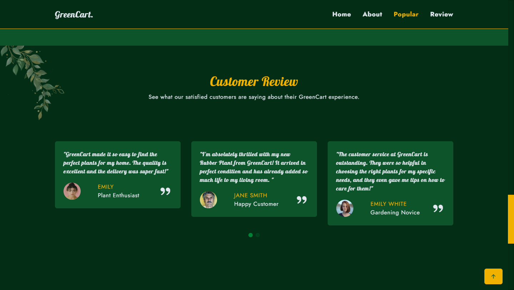
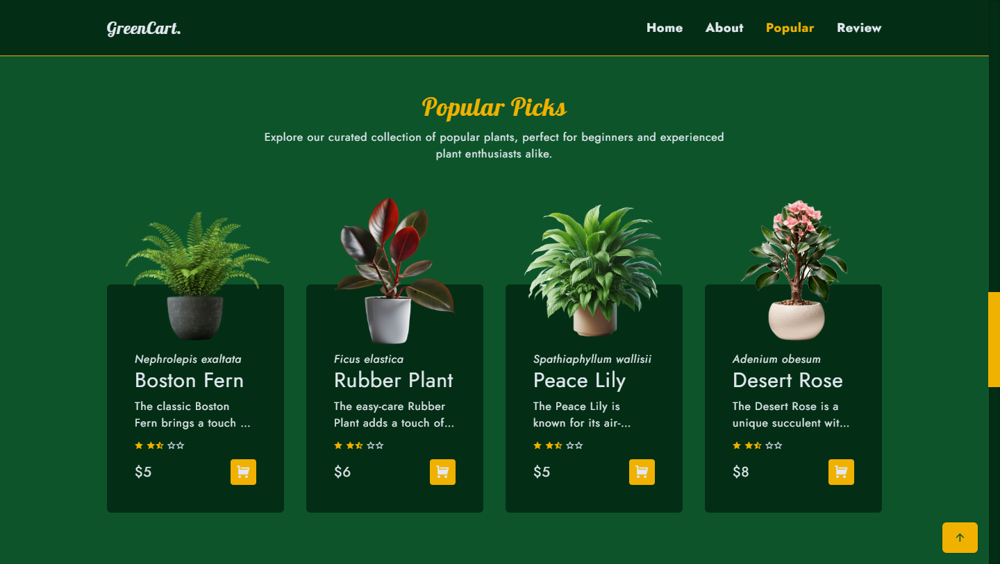
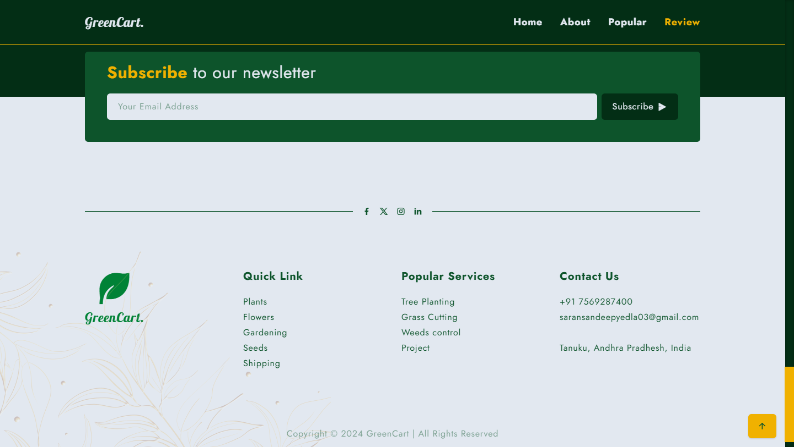

# GreenCart - Your Online Plant Store

## live site URL

url - [https://green-cart-psi.vercel.app/]

## Overview

GreenCart is a modern and user-friendly online plant store designed to bring the beauty and benefits of nature directly to your home. Browse our curated selection of indoor and outdoor plants, enjoy fast delivery, and discover expert advice for nurturing your green companions.

## Key Features

- **User-Friendly Interface:** Enjoy a seamless browsing and shopping experience with our intuitive website design.
- **Mobile-Responsive:** Browse and shop on any device, from desktop to mobile.
- **Modern Design:** A visually appealing and engaging design powered by Tailwind CSS.

## Screenshots

- **Homepage:**
  

- **About:**
  

- **Customer Review:**
  

- **Popular Picks:**
  

- **Footer:**
  

## Technologies Used

- **HTML:** The foundation of the website structure and content.
- **CSS:** Styling and layout with a focus on responsive design.
- **Tailwind CSS:** A utility-first CSS framework for rapid UI development.
- **JavaScript:** Interactive elements, slider functionality, and scroll animations.
- **Swiper.js:** A modern touch slider for showcasing customer reviews and other featured content.
- **ScrollReveal.js:** Animate elements on scroll for a dynamic user experience.
- **Remix Icon:** A comprehensive icon set for visual enhancements.
- **Vite:** A build tool that provides a fast and optimized development experience.

## Project Structure

```

GreenCart/ # Root directory of the project
├── node_modules/ # Node.js dependencies (not tracked in Git)
├── public/ # Publicly accessible assets (e.g., images, fonts)
├── src/ # Source code directory
│ ├── main.js # Main JavaScript file
│ └── style.css # Main CSS file
├── .gitignore # Specifies intentionally untracked files that Git should ignore
├── index.html # Main HTML file
├── package-lock.json # Records the exact versions of dependencies
├── package.json # Contains project metadata and dependencies
├── README.md # Project documentation
├── tailwind.config.js # Tailwind CSS configuration file
└── vite.config.ts # Vite configuration file
```

## Setup and Installation

1.  **Clone the repository:**

    ```
    git clone [your-repository-url]
    cd GreenCart
    ```

2.  **Install Dependencies:**

    ```
    npm install  # or yarn install or pnpm install
    ```

3.  **Run the Project Locally with Vite:**

    ```
    npm run dev  # or yarn dev or pnpm dev
    ```

    Open your browser and navigate to `http://localhost:5173/`.

## Customization

- **Theme Customization:** Modify the CSS variables in `style.css` under the `@theme` directive to change the color scheme, fonts, and other visual aspects of the website.

  ```
  @theme {
    /* fonts */
    --font-lobster: "Lobster", serif;
    --font-jost: "Jost", serif;

    /* colors */
    --color-background: var(--color-green-950);
    --color-foreground: var(--color-slate-200);
    --color-primary: var(--color-yellow-500);
    ...
  }
  ```

- **Content Modification:** Edit the content of the website by modifying the HTML elements in `index.html`.

- **JavaScript Behavior:** Customize the JavaScript in `main.js` to change slider settings, animation behavior, and other interactive elements.

## Known Issues

- _Example: Image optimization needs further improvement for faster loading times._
- _Example: Reviews Section are showing static contents_

## Contributing

We welcome contributions to GreenCart! If you'd like to contribute, please follow these steps:

1.  Fork the repository.
2.  Create a new branch for your feature or bug fix.
3.  Make your changes and commit them with descriptive commit messages.
4.  Push your changes to your forked repository.
5.  Submit a pull request to the main repository.

## Contact

Yedla Saran Sandeep

- **Portfolio:** [https://personal-portfolio-mocha-psi-53.vercel.app/]
- **GitHub:** [https://github.com/Saran-Sandeep]
- **LinkedIn:** [https://www.linkedin.com/in/saran-sandeep-yedla/]
- **Email:** saransandeepyedla03@gmail.com
